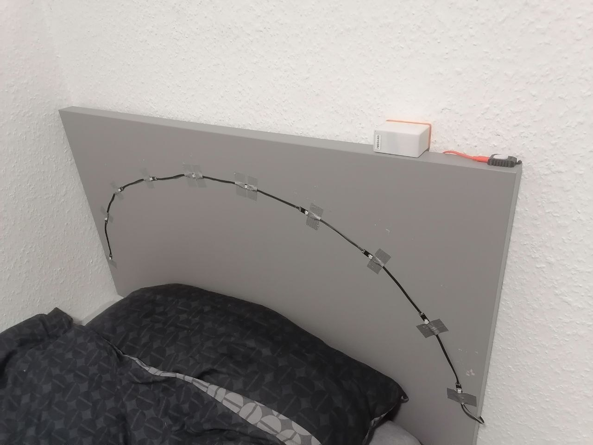

# MOS1 - Engineering Portfolio

Статический сайт-галерея проектов. Без сборки, без зависимостей, без сервера -
чистый HTML/CSS/JS, который можно бесплатно хостить на **GitHub Pages**.

```
portfolio-site/
├── index.html                  ← главная страница (hero + сетка карточек)
├── README.md                   ← этот файл
├── assets/
│   ├── css/style.css            ← все стили и дизайн-токены (цвета, шрифты)
│   ├── js/particles.js          ← глобальный анимированный фон с частицами
│   ├── js/scrollbar.js          ← HUD-индикатор скролла (altimeter tape)
│   ├── js/logo-scroll.js        ← анимация лого hero → угол (только главная)
│   ├── js/main.js                ← скролл-появление карточек + лайтбокс галерей
│   ├── img/logo.svg              ← маленькая иконка-метка (favicon)
│   └── img/logo-mos1.png        ← твой логотип-вордмарк (используется на сайте)
└── projects/
    ├── ldtm.html                ← LDTM
    ├── ultimate-mouse.html      ← Ultimate Mouse
    ├── loadometer.html          ← LoadOmeter
    ├── powerbrick-100w.html     ← PowerBrick 100W
    ├── cat-monitor.html         ← Cat Monitor "Kerfus"
    ├── nano-leaf.html           ← 5€ Nano Leaf
    ├── odradek-lamp.html        ← Odradek Lamp
    ├── lab-power-supply.html    ← Lab Power Supply
    ├── rc-blinker.html          ← RC Blinker (заглушка, текста пока нет)
    ├── fpv-drone.html           ← FPV Drone
    ├── meshtastic-node.html     ← Meshtastic Node
    ├── printed-objects.html     ← 3D Printed Objects
    ├── nfc-music.html           ← NFC Music Machine (заглушка, в разработке)
    ├── mini-nano-powerbanks.html ← Mini & Nano Powerbanks
    └── nixie-clock.html         ← Nixie Clock (заглушка, текста пока нет)
```

Страницы новых проектов (всё, кроме LDTM/Ultimate Mouse/LoadOmeter) сделаны проще:
обзорный текст + датащит + одна галерея с пронумерованными заглушками фото,
без выдуманных этапов сборки. Как только опишешь реальные стадии разработки -
скажи мне, разобью на этапы как у LDTM/Ultimate Mouse/LoadOmeter.

## Что изменилось в этой версии

- Верхней навигационной полосы больше нет.
- Логотип на главной странице стартует крупно по центру hero, а при скролле
  плавно уезжает в левый верхний угол и остаётся там как фиксированная плашка
  (логика - `assets/js/logo-scroll.js`). На страницах проектов лого сразу
  показано маленьким в углу, без анимации.
- Справа сверху - фиксированная плашка `SYSTEM STATUS: ONLINE` лаймового цвета.
- Справа на всю высоту экрана - HUD-индикатор скролла в стиле авиационного
  альтиметра: деления 0–100 оранжевые, указатель и считыватель - белые,
  фон полупрозрачный, сквозь него видно анимацию частиц (`assets/js/scrollbar.js`).
  На экранах уже ~860px эта полоса скрывается, чтобы не мешать на телефоне.
- Акцентный цвет сайта - `#ff9b0f` (одна переменная `--signal` в самом верху
  `style.css`, меняет всё сразу: рамки, ссылки, ховеры, деления индикатора).
- Весь текст сайта - на английском.
- Заглушки фото/gif пронумерованы (`PHOTO 01`, `PHOTO 02`, `GIF 01`...),
  чтобы было легко находить и менять их по порядку прямо на GitHub.

## Последние правки

- Центральный логотип в hero увеличен (~2.5×), угловые HUD-рамки вокруг него - тоже.
  Логотип-плашка в углу после скролла - крупнее (~1.5×). Размеры задаются в
  `style.css` (`.logo-slot`/`.logo-float` - центр, `.logo-corner` - угол) и
  автоматически считываются `logo-scroll.js`, отдельно трогать JS не нужно.
- Полоса-индикатор скролла стала уже (`--altimeter-w` в `style.css`) и теперь
  заполнена делениями на любую высоту экрана - диапазон шкалы в `scrollbar.js`
  (`TICK_MIN`/`TICK_MAX`) сделан с большим запасом, чтобы не было пустот сверху/снизу.
- Частицы на фоне: количество увеличено (~1.7×), они слегка "толкаются" в момент
  скролла (импульс от направления и скорости скролла) и подсвечиваются ярче и крупнее
  рядом с курсором мыши. Все настройки - в начале `particles.js`
  (`MOUSE_RADIUS`, коэффициенты в `initParticles()`/`frame()`).
- Угловые HUD-рамки вокруг центрального лого убраны совсем (криво показывались на телефоне).
- Логотип увеличен ещё раз: в центре +10%, в углу +30%. Частиц на фоне теперь в 2 раза больше.
  Подпись PROJECTS под лого крупнее на 50%.
- Ссылка GitHub в футере ведёт на твой реальный профиль (`github.com/MOS1-machine`).
- На главную добавлены 12 новых проектов (MOD-04 - MOD-15) по твоим описаниям:
  PowerBrick 100W, Cat Monitor "Kerfus", 5€ Nano Leaf, Odradek Lamp, Lab Power Supply,
  RC Blinker (заглушка), FPV Drone, Meshtastic Node, 3D Printed Objects, NFC Music Machine
  (заглушка), Mini & Nano Powerbanks, Nixie Clock (заглушка). У трёх ("RC Blinker",
  "NFC Music Machine", "Nixie Clock") пока нет полного описания - текст и фото можно
  дописать прямо в HTML, структура уже на месте.
- Описание LDTM исправлено: это не носимое устройство, а лента, закреплённая на
  изголовье кровати.
- Оранжевая часть заголовка на каждой странице проекта теперь анимируется как
  табло-флипчат (вокзальное/аэропортовое табло): буквы прокручиваются через
  случайные символы и одна за другой "защёлкиваются" на нужном символе.
  Логика в `assets/js/flap.js`, применяется к любому элементу с классом
  `flap-text` (сейчас это только оранжевая `<span>` в `<h1>` каждой страницы).
- На карточках главной страницы оставлена только строка MCU. Если у проекта
  нет MCU (например RC Blinker) или его главная характеристика была не MCU
  (LED-лента, BMS, выход и т.п.), строка спеков с карточки убрана совсем,
  ничего не пишется.
- Карточки проектов теперь слегка увеличиваются при наведении курсора
  (в дополнение к существующему лёгкому подъёму вверх).

## 1. Посмотреть локально

Просто открой `index.html` в браузере - двойным кликом, без серверов.
Для разработки удобно открыть папку в VS Code и запустить "Live Server".

## 2. Бесплатный хостинг на GitHub Pages

1. Создай новый репозиторий на GitHub, например `mos1-portfolio`.
2. Залей туда содержимое папки `portfolio-site` (не саму папку, а её содержимое -
   `index.html` должен лежать в корне репозитория):
   ```bash
   cd portfolio-site
   git init
   git add .
   git commit -m "Первая версия сайта"
   git branch -M main
   git remote add origin https://github.com/<твой-логин>/mos1-portfolio.git
   git push -u origin main
   ```
3. На GitHub: **Settings → Pages → Build and deployment**.
   В разделе "Source" выбери **Deploy from a branch**, ветка `main`, папка `/ (root)`.
4. Сохрани - через минуту-две сайт будет доступен по адресу:
   `https://<твой-логин>.github.io/mos1-portfolio/`

Готово. Любой `git push` после этого обновляет сайт автоматически.

## 3. Как добавить фото/gif в карточку на главной странице

В `index.html` найди карточку нужного проекта, внутри `<div class="card-thumb">`
есть заглушка вида:

```html
<div class="card-thumb">
  <!-- TODO: replace with  -->
  <p class="ph-label"><span class="icon">▣</span>COVER&nbsp;PHOTO</p>
</div>
```

Замени на:

```html
<div class="card-thumb">
  
</div>
```

Сами файлы изображений клади в `assets/img/projects/<имя-проекта>/`.

## 4. Как добавить фото/gif в журнал сборки проекта

Внутри каждого `projects/*.html` шаги сборки оформлены так (заглушки
пронумерованы по порядку - `PHOTO 01`, `PHOTO 02`, `GIF 01`...):

```html
<div class="gallery-grid">
  <figure class="gallery-item">
    <p class="ph-label"><span class="icon">▣</span>PHOTO&nbsp;01</p>
  </figure>
</div>
```

Замени на реальное изображение и добавь `data-full`, чтобы фото открывалось
в полноэкранном просмотре по клику:

```html
<div class="gallery-grid">
  <figure class="gallery-item" data-full="../assets/img/projects/ldtm/step1-a.jpg">
    
    <figcaption>First WS2812B strip test</figcaption>
  </figure>
</div>
```

Для gif - то же самое, просто `src="...gif"`. Для коротких клипов вместо gif
советую `<video src="..." autoplay loop muted playsinline></video>` -
видео в разы легче по весу при той же картинке.

## 5. Как добавить новый проект целиком

1. Скопируй любую из простых страниц (например `projects/rc-blinker.html`) под
   новым именем, например `projects/unity-rocket.html`.
2. Замени заголовок, датащит (`<div class="datasheet">`), обзорный текст и
   количество заглушек в `<div class="gallery-grid">`.
3. На главной странице скопируй блок одной из карточек `<article class="card">`,
   поменяй текст, MOD-номер и ссылку `href="projects/unity-rocket.html"`.

## 6. Замена логотипа

`assets/img/logo-mos1.png` - основной логотип, используется в hero-анимации
и в углу на страницах проектов. Если заменишь файлом с другими пропорциями,
поправь `aspect-ratio` у `.logo-slot` в `style.css` (сейчас `2470 / 1539` -
это пропорции твоего текущего файла).

`assets/img/logo.svg` - маленькая иконка-favicon (показывается в вкладке браузера),
можно оставить как есть или заменить на квадратную версию своего лого.

## 7. Цвета, частицы, индикатор скролла

- Акцентный цвет - переменная `--signal` в самом верху `assets/css/style.css`.
- Плотность/скорость частиц - `assets/js/particles.js`, переменная `count`
  внутри `initParticles()`.
- Индикатор скролла (altimeter) - `assets/js/scrollbar.js`, шаг делений и их
  яркость настраиваются в CSS-классах `.altimeter .tick`.

## 8. Советы по медиафайлам

- Сжимай фото перед загрузкой (например через [squoosh.app](https://squoosh.app)) -
  целевой размер ~150–400 КБ на фото.
- Gif лучше конвертировать в `.mp4`/`.webm` - вес падает в 5–10 раз при той же картинке.
- Не выкладывай файлы тяжелее ~10 МБ - GitHub Pages не предназначен для видеохостинга.
